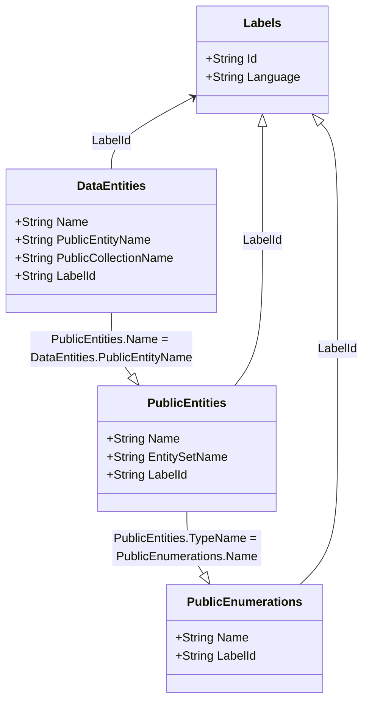

# Introduction
The purpose of this document is to give users an overview to the usage of OData ( https://www.odata.org/ ) and related endpoints within the context of Dynamics 365 Finance & Operations (F&O). I will cover basic concepts within the document, however users may wish to visit the odata.org site for a more detailed explaination of things like what a function means outside of the context of Finance & Operations.

As always, this is my personal interpretation of the system, my background is that of a Dynamics 365 Finance & Operations (formerly 'AX') functional consultant, with a cursory knowledge of the underlying technology. 

I am **not** an expert in HTTP, REST or OData itself, as a thing, but I am a regular user of these technologies through the lens of F&O

# Endpoints
The Dynamics 365 Finance & Operations platform has an excellent set of endpoints which can be explored by users when considering prototyping external application interactions. The two most common ones are as follows

- Metadata
- Data

This document will focus on metadata, further documents (including postman samples) will be added to this wiki soon.

## Metadata
This is a descriptive endpoint, which contains information about the data entities within the system, alongside information on labels, which are used in Finance & Operations to enable multilingual support.

### Relationships
The below diagram shows how each piece of metadata is related to each other, generally speaking

- Labels are used in all element of Finance & Operations to enable a multilingual experience
- The data entities collection contains the most extensive list of entities available within the system (n.b. this includes both standard and custom entities)
- The public entity collection is most exhaustive and serves as the reference point when constructing odata calls
- The public enumerations collection is used when constrained option values are required to be sent to Finance & Operations in POST requests or returned in GET's



#### Relationship Keys

| From Entity | To Entity | Relationship |
| ----------- | --------- | ------------- 
| __Any__ | Labels | __Entity__.LabelId = Labels.LabelId |
| DataEntities | PublicEntities | DataEntities.PublicEntityName == PublicEntities.Name |
| PublicEntities | PublicEnumerations | PublicEntities.LabelId == PublicEnumerations.LabelId |
| PublicEntities | PublicEnumerations | PublicEntities.TypeName (minus Microsoft.Dynamics.DataEntities. ) == PublicEnumerations.Name |

### Labels
This endpoint is at

    GET https://FinOpsURL/metadata/Labels(Id='LabelID',Language='Language ID')

**N.B** This endpoint does NOT accept open exploration, users must specify the label ID and language they want

An example of the return for the Customers V3 entity is shown below.
Language codes given must be valid codes in Finance & Operations

```json
    {
        "@odata.context": "https://FinOpsURL/metadata/$metadata#Labels/$entity",
        "Id": "@AccountsReceivable:CustCustomerV3EntityLabel",
        "Language": "en-GB",
        "Value": "Customers V3"
    }
```

### Data Entities

This endpoint is at

    GET https://FinOpsURL/metadata/DataEntities

This entity contains information about individual entities and is a good starting point for understanding which entities are in the system.
A sample of the data (based on the CustomerV3 entity) returned is illustrated below:

```json
    {
        "Name": "CustCustomerV3Entity",
        "PublicEntityName": "CustomerV3",
        "PublicCollectionName": "CustomersV3",
        "LabelId": "@AccountsReceivable:CustCustomerV3EntityLabel",
        "DataServiceEnabled": true,
        "DataManagementEnabled": true,
        "EntityCategory": "Master",
        "IsReadOnly": false
    }
```   

Example at:

    GET https://FinOpsURL/metadata/DataEntities?$filter=PublicEntityName eq 'CustomerV3'

This endpoint can be useful primarily for the last 4 elements shown in the sample.

| Element | Description |
|---------| ------------|
|DataServiceEnabled | The data entity is enabled for odata usage |
| DataManagementEnabled | The data entity is enabled for in (bulk) data management, via the client data management functionality and the package API |
| EntityCategory | The category the entity belongs to, useful for filtering |
| IsReadOnly | The data entity is read only, no updates or creates are possible |

In the example given above, I have filtered for the PublicEntityName, which is a useful way to explore just the data you need. This will use the singular name for the entity, as shown in Finance & Operations.

### Public Entities
This endpoint is at

    GET https://FinOpsURL/metadata/PublicEntities

It contains much more extensive data on the content of the data entity. The below example shows the summary information of what is contained within the response, by section

    Name: 	                "CustomerV3"
    EntitySetName:	        "CustomersV3"
    LabelId: 	            "@AccountsReceivable:CustCustomerV3EntityLabel"
    IsReadOnly:	            false
    ConfigurationEnabled:	true
    Properties:	            […]
    NavigationProperties:	[…]
    PropertyGroups:	        []
    Actions:

#### Subsections

| Subsection Name | Description |
| --------------- | ----------- |
| Properties | Each field exposed by the data entity is shown below here. More on this is given below. |
| NavigationProperties | Shows the related tables to this entity |
| PropertyGroups | Field groupings |
| Actions | Certain odata entities exposure functions to execute business logic beyond just creating individual records |

#### Properties
This gives detail of an individual field exposed by the data entity, including the field name, the datatype, whether is is mandatory, read only etc...
An example is given below of a property for how customer account statements are generated.

```json
    {
        "Name": "AccountStatement",
        "TypeName": "Microsoft.Dynamics.DataEntities.CustAccountStatement",
        "DataType": "Enum",
        "LabelId": "@SYS14680",
        "IsKey": false,
        "IsMandatory": false,
        "ConfigurationEnabled": true,
        "AllowEdit": true,
        "AllowEditOnCreate": true,
        "IsDimension": false,
        "DimensionRelation": null,
        "IsDynamicDimension": false,
        "DimensionLegalEntityProperty": null,
        "DimensionTypeProperty": null
    }
```

In the above example, the field is an enumeration (enum), which can be located in the [Public Enumerations](#Public-Enumerations) section.

**N.B.** There are two ways to filter for a public enumeration when traversing from property to public enum, either via labelId = labelId or TypeName = Name
If using the TypeName, the filter criteria should **not** include the __Microsoft.Dynamics.DataEntities.__ prefix

### Public Enumerations
This endpoint is at

    GET https://FinOpsURL/metadata/PublicEnumerations

It contains information about the enumeration options available for properties with the enum type. Users familiar with Microsoft Dataverse (formerly Dynamics 365 CRM / Common Data Service) as a platform may be familiar with options, which are similar to enums. Those from a dotnet background should note that within Dynamics 365 Finance & Operations enum values as specified explictly rather than using the value in array (at least via Odata).

The below example shows the Customer Account Statement option.
**N.B.** The enum name will be used as the enum value, however the LabelId is used within the Dynamics 365 client to handle multi-lingual implementation.

```json
    {
        "Name": "CustAccountStatement",
        "LabelId": "@SYS14680",
        "Members": [
            {
                "Name": "Always",
                "LabelId": "@SYS14585",
                "Value": 0,
                "ConfigurationEnabled": true
            },
            {
                "Name": "Quarter",
                "LabelId": "@SYS4759",
                "Value": 1,
                "ConfigurationEnabled": true
            },
            {
                "Name": "Biannually",
                "LabelId": "@SYS2841",
                "Value": 2,
                "ConfigurationEnabled": true
            },
            {
                "Name": "Yearly",
                "LabelId": "@SYS14574",
                "Value": 3,
                "ConfigurationEnabled": true
            },
            {
                "Name": "Never",
                "LabelId": "@SYS1091",
                "Value": 4,
                "ConfigurationEnabled": true
            }
        ]
    }
```


